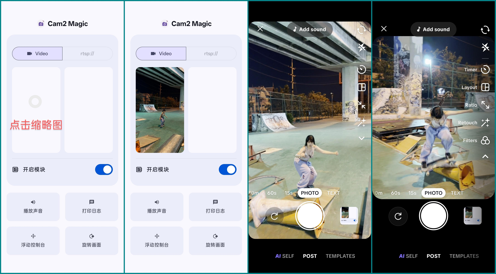

# Camera2 Magic：一个虚拟摄像头模块？支持 android 10 +   

### Camera2 magic 1.0.1 
  - 仅支持 api 101，需要安装LSPosed 2.0.0+
  - 设备需要支持`MediaCodec`解码
  - 安装本模块后，在`LSPosed管理器`中激活模块，并勾选作用域。
  - 请将使用的媒体文件放在共享存储目录中，如：`DCIM`；模块和被hook的应用需要被授权访问图片和视频
  - 打开模块UI界面，点击缩略图区域，在弹出的媒体选择器中选择媒体文件
  - 在模块生效后，可以使用点击`开启模块`开关来启用或暂停Hook
  - 根据需要启用声音播放；在使用图片替换的时候，该菜单点击时无任何效果
  - 目前只可以使用本地文件，网络视频流还在画饼中
  - 支持应用中WebRTC（camera2 api）使用相机，仅测试Telegram 
  - 在某些需要高稳定性画面的使用场景，请勿使用本模块，“如被封号 概不负责”

### 特点
  - 大部分视频均可以傻瓜式使用，不需要关注视频和宿主的分辨率是否匹配
  - 尽可能使用竖版的视频，而不是横板视频；以免两侧被裁切过多
  - 在一些应用中，仅切换预览画面比例时，不会打断预览画面

 

### hook camera1/2 api
  - [x] 使用本地视频 hook   
    - [x] 完成一些网络视频流支持的初期工作   
    - [x] 使用 `AMediaCodec` 视频硬解码（sm8250大致流畅 4k@60fps HEVC）  
      - [x] 双缓冲 (Ping-Pong Mechanism)  
      - [x] 使用GPU转码nv21  
    - [x] 音频解码 初步的音频支持  
  - [x] 使用静态图片 hook  
  - [ ] 使用网络视频流 hook  
  - [x] 替换预览画面  
    - [x] 裁切图像适配 `preview surface` ratio，尽可能不会拉伸变形  
    - [x] 适配目标应用实时切换 ratio    
  - [x] 高效生成 `nv21 byte[]`   
    - [x] `camera1 api` 拍照 使用当前 nv21 bytes数据（默认）   

### 感谢
  - 使用了 FFmpeg 解复用 [官网链接](https://ffmpeg.org/)
  - libjepg-turbo [官网链接](https://libjpeg-turbo.org/)

